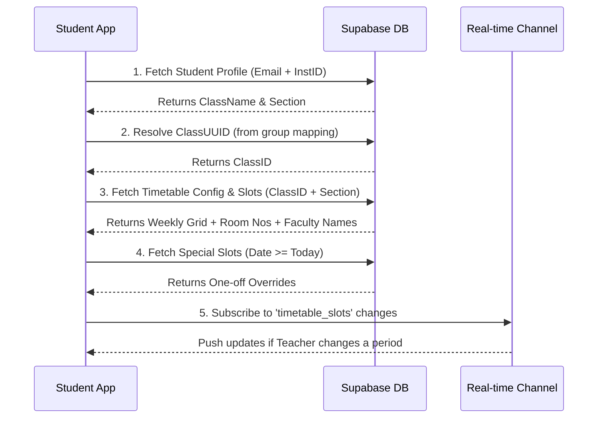
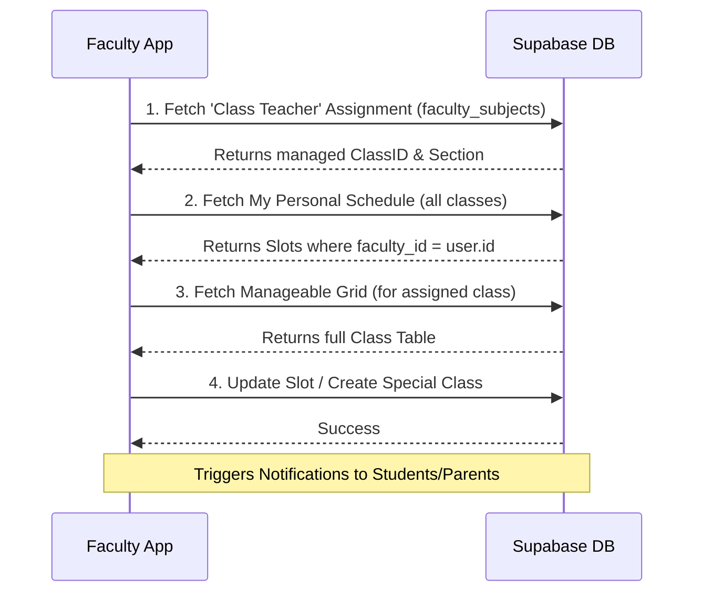

# Detailed Timetable Flow & Architecture

This document details how the timetable system works for both Faculty and Students, including database schemas, retrieval logic, and real-time interlinkages.

---

## 1. Database Schema Architecture

The system uses three primary tables to manage all scheduling logic:

### A. `timetable_configs` (The Rules)
Defines the structure of a day for an institution or a specific class.
- **Key Fields**: `periods_per_day`, `period_duration_minutes`, `start_time`, `lunch_start_time`, `short_break_start_time`, `extra_breaks` (JSONB).
- **Purpose**: Used to calculate the "Time Grid" (e.g., Period 1 is 9:00 - 9:45) dynamically in the UI.

### B. `timetable_slots` (The Recurring Schedule)
Stores the weekly "Master" timetable.
- **Key Fields**: `config_id`, `faculty_id`, `class_id`, `section`, `day_of_week` (Monday-Saturday), `period_index` (1-8), `subject_id`, `room_number`.
- **Purpose**: The source of truth for the student's regular weekly classes and the faculty's teaching board.

### C. `special_timetable_slots` (The Overrides)
Manages one-off changes (extra classes, guest lectures, shifted periods).
- **Key Fields**: `event_date` (Date), `class_id`, `faculty_id`, `subject_id`, `start_time`, `title` (Reason).
- **Purpose**: These slots "mask" or "add to" the regular schedule for a specific date.

---

## 2. Technical Flows

### Student Timetable Flow


### Faculty Timetable Flow


---

## 3. Dashboard Interlinkages

### Dashboard Integration
- **Faculty Dashboard**: Uses [useFacultyDashboard](file:///c:/Users/kamal/OneDrive/Desktop/UNAI%20Tech/My%20Vidyon/My-Vidyon_APP/src/hooks/useFacultyDashboard.ts#25-254) hook to filter `timetable_slots` for `TODAY` and `USER_ID`.
- **Student Dashboard**: Uses [useStudentDashboard](file:///c:/Users/kamal/OneDrive/Desktop/UNAI%20Tech/My%20Vidyon/My-Vidyon_APP/src/hooks/useStudentDashboard.ts#39-511) to show "Today's Classes" based on their specific class mapping.

### Cross-Module Connections
1. **Attendance**: When a teacher marks attendance, the app looks at the **Timetable** to see which subject is currently scheduled, auto-selecting it in the marking interface.
2. **Notifications**: When a Faculty member creates a **Special Class**, a database trigger (or manual update) inserts a record into the `notifications` table for every student in that `class_id`, alerting them via the mobile/web app.
3. **Communication**: In the Student Timetable view, clicking a teacher's name pulls from the `profiles` table to offer a one-click WhatsApp or Phone call option.

---

## 4. Key Retrieval Logic (Pseudocode)

**Standard Weekly View:**
```sql
SELECT * FROM timetable_slots 
JOIN subjects ON subject_id = subjects.id
JOIN profiles ON faculty_id = profiles.id
WHERE class_id = 'STUDENT_CLASS_ID' AND section = 'STUDENT_SECTION'
ORDER BY day_of_week, period_index;
```

**Override Logic (UI Layer):**
If viewing a specific date (e.g., 2026-03-20):
1. Load `timetable_slots` for that Day of Week (Friday).
2. Load `special_timetable_slots` for `event_date = '2026-03-20'`.
3. If a Special Slot exists for Period X, display **Special Slot**; else display **Regular Slot**.
